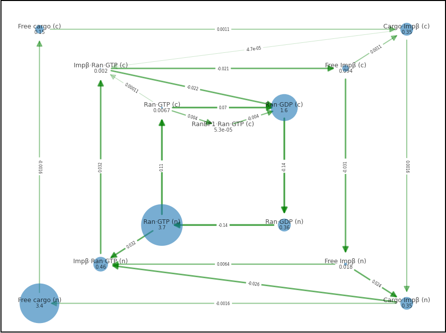

To visualize the results,
run `run_model` in Matlab
(requires SimBiology).
This should produce a `.mat`
in the folder [results](./results).
Then run `b_graph1.py`
from the folder [python](./python).
This should produce the figures
in the [b_graph1](./python/b_graph1) subfolder.

