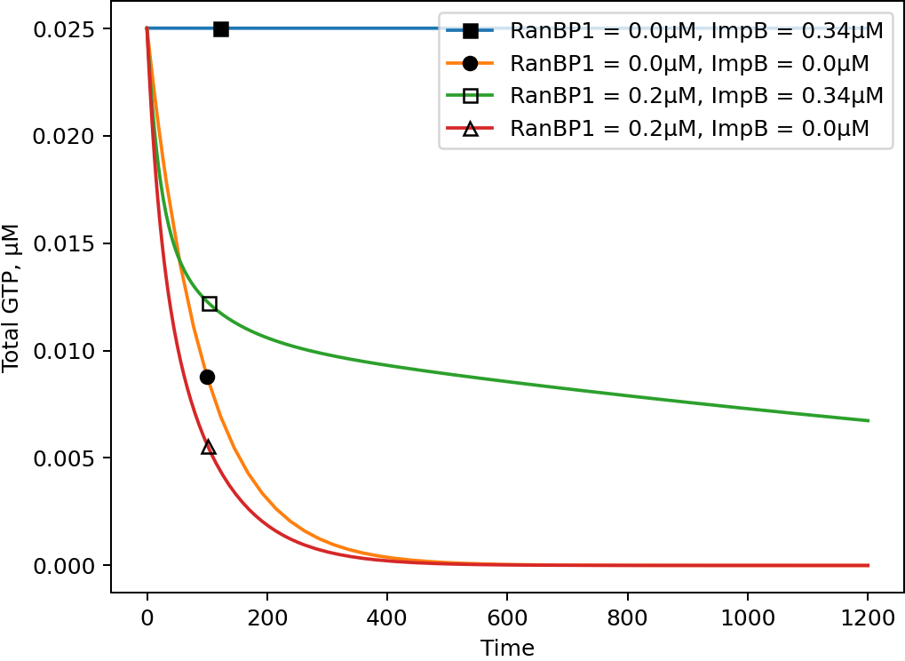

# Role of RanBP1 in GTP hydrolysis

The following figure is a computational
reproduction 
of 
[Fig 4A](https://i.ibb.co/6ghqPB7/image.jpg)
from 
[LM97].
See the Matlab script 
[simulate_effective.m](./simulate_effective.m).

[LM97]
K. M. Lounsbury and I. G. Macara.
“Ran-binding Protein 1 (RanBP1) forms a ternary complex 
with Ran and Karyopherin β and reduces 
Ran GTPase-activating protein (RanGAP) inhibition by Karyopherin β”,
In: 
Journal of Biological Chemistry
272.1 (Jan. 1997), pp. 551--555 
[[doi](https://doi.org/10.1074/jbc.272.1.551)].
