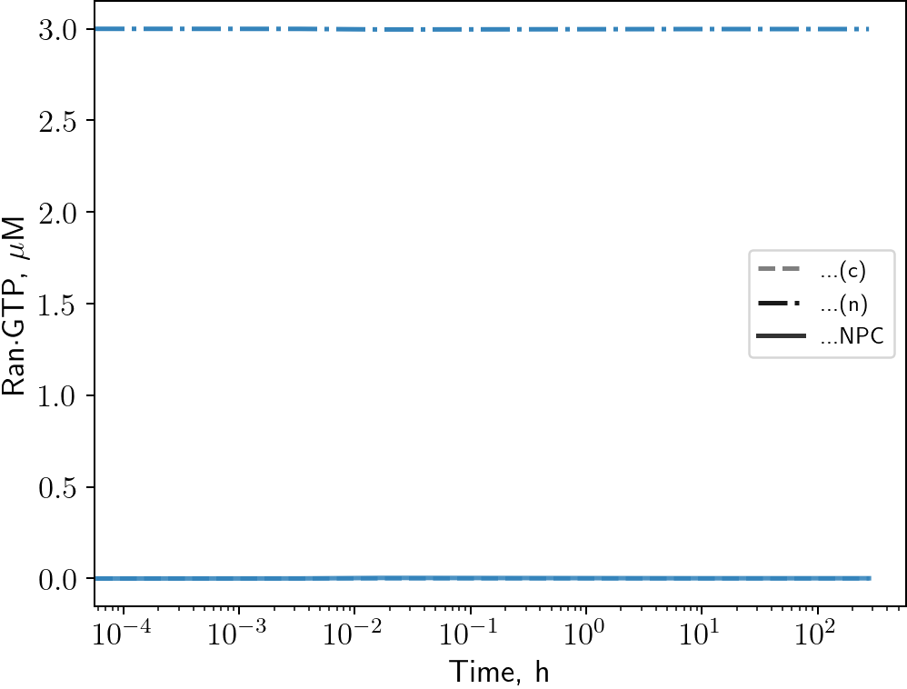

|                  | Both_0                                                 | Baseline2_sym                                                 | Baseline2                                                 | Baseline1                                                 | OldBaseline                                                 | Both_2                                                 | Only_dCAS_1                                                 | Both_1                                                 | Only_dCAS_2                                                 |
|:-----------------|:-------------------------------------------------------|:--------------------------------------------------------------|:----------------------------------------------------------|:----------------------------------------------------------|:------------------------------------------------------------|:-------------------------------------------------------|:------------------------------------------------------------|:-------------------------------------------------------|:------------------------------------------------------------|
| CAS (excl. ΔCAS) |  |  |  |  |  |  |  |  |  |
| ΔCAS             |              |              |              |              |              |              |              |              |              |
| ImpB             |              |              |              |              |              |              |              |              |              |
| ImpA             |              |              |              |              |              |              |              |              |              |
| Ran·GTP          |           |           |           |           |           |           |           |           |           |
| NLS              |               |               |               |               |               |               |               |               |               |
